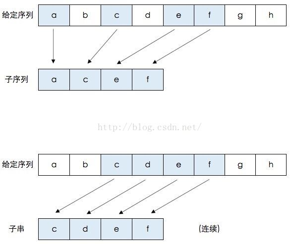
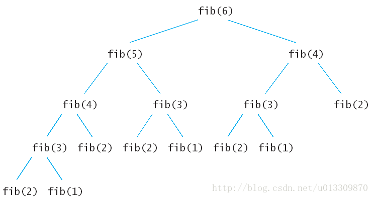
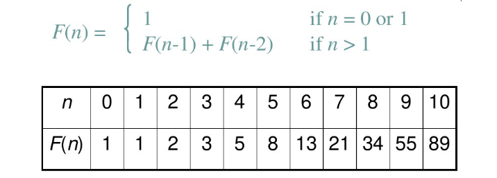
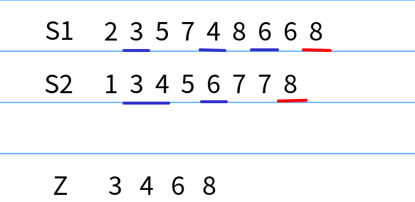
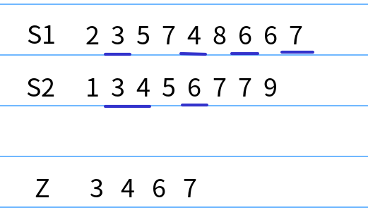
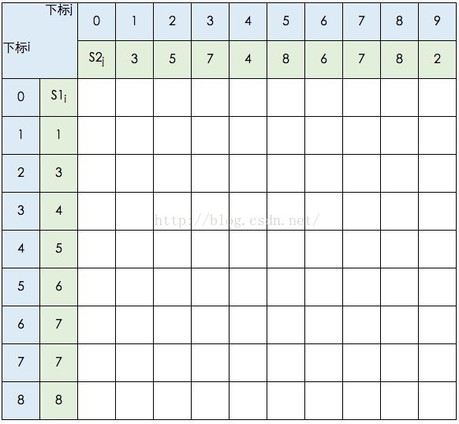
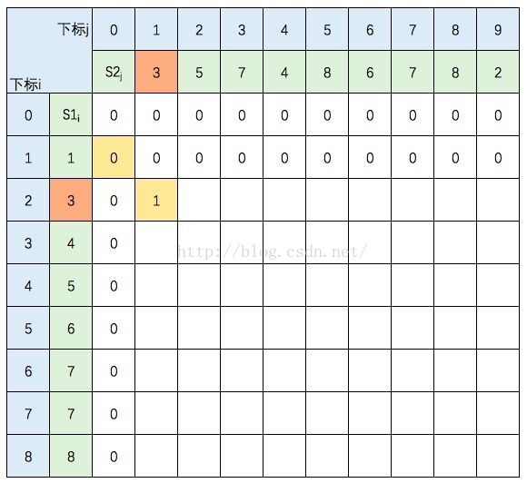
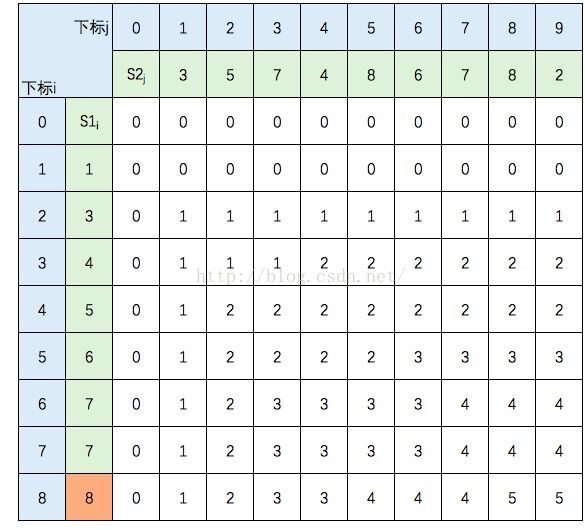
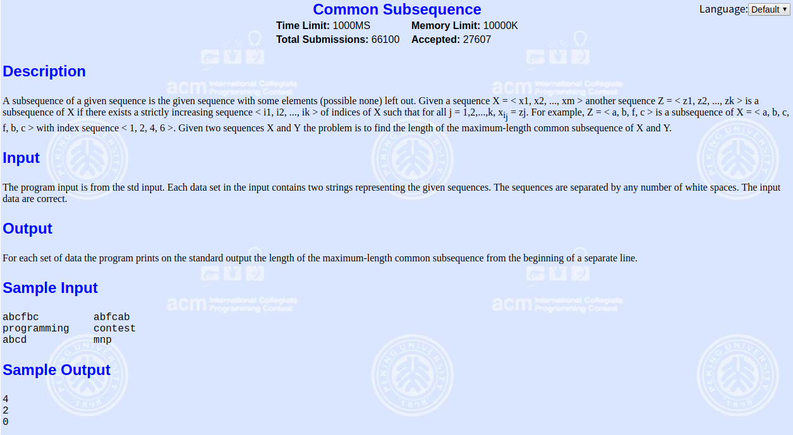
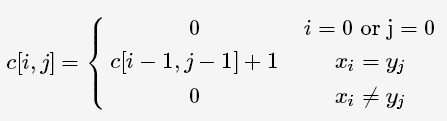

<!-- $size: 16:9 -->
<!-- page_number: true -->


# LCS—最长公共子序列


<small>最长公共子序列不需要连续</small>

---


给定序列
s1={3,5,7,4,8,6,7,8,2}
s2={1,3,4,5,6,7,7,8}
s1和s2的相同子序列，且该子序列的长度最长，即是LCS
s1和s2的其中一个最长公共子序列是 {3,4,6,7,8}

---

# 动态规划法求LCS

 动态规划算法通常用于求解具有某种==最优性质==的问题。
 在这类问题中，可能会有许多可行解。每一个解都对应于一个值，我们希望找到具有==最优值==的解
 例如LCS中的‘最长’
 
---

# 动态规划法的基本思路
 1. 动态规划算法与分治法类似，其基本思想也是将待求解问题分解成若干个子问题，先求解子问题，然后从这些子问题的解得到原问题的解。
 2. 若用分治法来解这类问题，则分解得到的子问题数目太多，有些子问题被重复计算了很多次。
 3. 如果我们能够保存已解决的子问题的答案，而在需要时再找出已求得的答案，这样就可以避免大量的重复计算
 4. 将各阶段按照一定的次序排列好之后，对于某个给定的阶段状态，它以前各阶段的状态无法直接影响它未来的决策。换句话说，每个状态都是过去历史的一个完整总结，这就是无后效性
<hr/>
三个特点：最优子结构、重叠子问题、无后效性

---

# 递归求斐波那契数列
数列：1、1、2、3、5、8、13、21、34、……
```c++
int f(int n)
{
    if(n == 0) return 0;
    if(n == 1 ) return 1;
    if(n >= 2)
    {
        return f(n-1)+f(n-2);
    }
}
```
这种算法并不高效,它做了很多重复计算,它的时间复杂度为$O(2^n)$

---


在斐波拉契数列，可以看到大量的重叠子问题，比如说在求`fib(6)`的时候，`fib(2)`被调用了5次。如果使用递归算法的时候会反复的求解相同的子问题，不停的调用函数，而不是生成新的子问题。

---

# 动规求斐波那契数列
使用动态规划来将重复计算的结果具有”记忆性”,就可以将时间复杂度降低为O(n)
```c++
void f()
{
    int f[10];
    f[0] = 0;
    f[1] = 1;
    for(int i = 2; i <= 10; i++)
        f[i] = f[i-1] + f[i-2];
}
```


---

# 回到原题，求解LCS
<big>解决LCS问题，需要把原问题分解成若干个子问题，所以需要刻画LCS的特征</big>
设S1={A0,A1, ... ,Am}，S2={B0,B1, ... Bn}，它们LCS为Z={Z1,Z2, ... ,Zk}
1. 如果Am=Bn，则Zk=Am=Bn，且{Z1, Z2, ..., z(K-1)}是{A0,A1, ... ,A(m-1)}和{B0,B1, ... B(n-1)}的一个最长公共子序列
<br/>


即假如S1的最后一个元素 与S2的最后一个元素相等，那么S1和S2的LCS就等于 <font color=red>{S1减去最后一个元素} 与 {S2减去最后一个元素} 的 LCS  再加上 S1和S2相等的最后一个元素</font>

---

设S1={A0,A1, ... ,Am}，S2={B0,B1, ... Bn}，它们LCS为Z={Z1,Z2, ... ,Zk}

2. 如果Am=Bn
	- 若Zk!=Am，则{Z1,Z2, ... ,Zk}是{A0,A1, ... ,A(m-1)}和{B0,B1, ... Bn}的一个最长公共子序列
	- 若Zk!=Bn，则{Z1,Z2, ... ,Zk}是{A0,A1, ... ,Am}和{B0,B1, ... B(n-1)}的一个最长公共子序列

		
        
假如S1的最后一个元素 与 S2的最后一个元素不等，那么S1和S2的LCS就等于 ： <font color=red>MAX( {S1减去最后一个元素} 与 S2 的LCS， {S2减去最后一个元素} 与 S1 的LCS)</font>

---


# 递推式
假设我们用C[i,j]表示Xi 和 Yj 的LCS的长度（直接保存最长公共子序列的中间结果不现实，需要先借助LCS的长度）。其中X = {x1 ... xm}，Y ={y1...yn}，Xi = {x1 ... xi}，Yj={y1... yj}。
可得递归公式如下：


---


s1={1,3,4,5,6,7,7,8}，s2={3,5,7,4,8,6,7,8,2}

图中的空白格子需要填上相应的数字（这个数字就是C[i,j]的定义，记录的LCS的长度值）。填的规则依据公式，简单来说：如果横竖（i,j）对应的两个元素相等，该格子的值 = c[i-1,j-1] + 1。如果不等，取c[i-1,j] 和 c[i,j-1]的最大值。

---

首先初始化该表。


---

当i=2，j=1时，S1的元素3 与 S2的元素3 相等，所以 C[2,1] = C[1,0] + 1



---

当i=2，j=2时，S1的元素3 与 S2的元素5 不等，C[2,2] =max(C[1,2],C[2,1])
图中C[1,2] 和 C[2,1] 背景色为浅黄色。
<style> table th:nth-of-type(1) { width: 50%;} </style>
|表格| 公式
|----- | ------|----
| ||

---

<style> table th:nth-of-type(1) { width: 50%;} </style>
|完整表格| 公式
|----- | ------|----
| |
根据性质，c[8,9] = S1 和 S2 的 LCS的长度，即为5

---

# 模板题--[POJ1458(Common Subsequence)](http://poj.org/problem?id=1458)

题意：输入不定行，每行两个字符串，求每一行两个字符串的最长公共子序列长度

---

```c++
const int MAXDP = 1e3;
const int MAXS = 1e7;
int dp[MAXDP][MAXDP];
char s1[MAXS], s2[MAXS];
int LCS(char* s1, char* s2)
{
    int len1 = strlen(s1) - 1;//因为s1,s2是从1开始存的，所以长度要减1
    int len2 = strlen(s2) - 1;
    for(int i = 0; i <= len1; i++)
        for(int j = 0; j <= len2; j++)
        {
            if(i == 0 || j == 0)	
            	dp[i][j] = 0;
            else if(s1[i] == s2[j])
                dp[i][j] = dp[i - 1][j - 1] + 1;
            else
                dp[i][j] = max(dp[i - 1][j], dp[i][j - 1]);
        }
        return dp[len1][len2];
}
int main()
{
    s1[0] = ' ', s2[0] = ' ';
    while(cin >> s1 +1 >> s2 + 1)
        cout << LCS(s1, s2) << endl;
    return 0;
} //时间复杂度：O（len1*len2)
```

---

# LCS进阶
1. 还原最长公共子序列、记录路径：[HDU1503(Advanced Fruits)](http://acm.hdu.edu.cn/showproblem.php?pid=1503)
2. LCS变形：
	- [POJ1080(Human Gene Functions)](http://poj.org/problem?id=1080)
	- [POJ3356(AGTC)](http://poj.org/problem?id=3356)

---

# 最长公共子串（连续）
和LCS区别是区别就是因为是连续的，如果两个元素不等，那么就要=0了而不能用之前一个状态的最大元素
|最长公共子串| 最长公共子序列
|----- | ------|----
| ||


---

# LIS--最长递增子序列
假设有序列A = {5, 2, 8, 6, 3, 6, 9, 7}
其递增子序列有：{5,8,9}, {2,6,9}, {5,6,7}……
其中，最长递增子序列为{2, 3, 6, 9}和{2, 3, 6, 7}

---

# 动态规划求LIS


