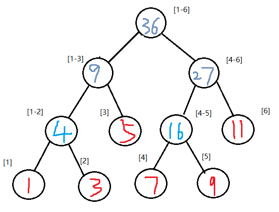
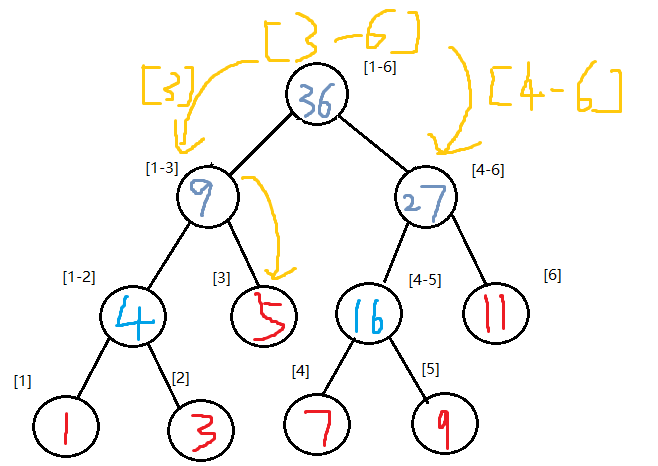
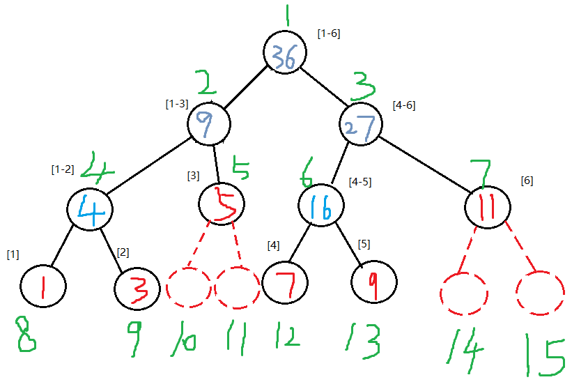

# 数据结构--线段树（segment）

## 引入

给定一个数组，数组长度可能非常大。现在我们需要对数组里面的数据反反复复进行两个操作

- 求出某一个区间里面所有元素之和，(query操作)
- 修改某个元素的值，(update操作)

### 暴力解决和前缀和

对区间[L,R]（长度为n）取和，并且更新一个元素i的值，采用暴力解决方法


可得
- query(L,R)时间复杂度为O(n)
- update(i)时间复杂度为O(1)


如果区间范围很大，再加上多次操作，暴力取和明显会超时，可以采用前缀和方式优化查询
sum_arr[0]=arr[0]
sum_arr[1]=arr[0]+arr[1]
sum_arr[2]=arr[0]+arr[1]+arr[2]

这样，假如我们想得到区间[2,4]的和，我们可以用sum_arr[4]-sum_arr[1]计算到

- query(L,R)时间复杂度减小为O(1)
- 因为改变一个值后，要同时更新后面的sum_arr数组，所以update(i)时间复杂度增大为O(n)

---
如果用线段树的话，我们可以将查询和更新的的时间复杂度都变为O(logn)
|方法| query|update|
|----- | ------|----|
|暴力 | O(n)|O(1)|
|前缀和|O(1)|O(n)|
|线段树|O(logn)|O(logn)|

---
## 线段树简介
线段树是一种二叉搜索树，它将一个区间划分成一些单元区间，每个单元区间对应线段树中的一个叶结点。使用线段树可以快速的查找某一个节点在若干条线段中出现的次数，时间复杂度为O(logn)。是一种可以在很短的时间内对某个区间进行操作的数据结构。

可用于：
单点修改、区间修改、区间查询（如：区间求和，求区间最大值，求区间最小值……）

---
## 线段树构建
|数组下标| 1|2| 3|4|5|6|
|----- | ------|----|----|----|----|----|
|数组元素|1|3|5|7|9|11|
树根保存的是区间[1-6]中元素的和，其左孩子保存区间[1-3]所有元素的和，右孩子则是[4-6]

它将一个区间划分成一些单元区间，每个单元区间对应线段树中的一个叶结点。
其划分区间方法类似于二分

---


---
然后给每个叶子结点赋值
|数组下标| 1|2| 3|4|5|6|
|----- | ------|----|----|----|----|----|
|数组元素|1|3|5|7|9|11|


---


接着由孩子结点构成双亲结点
|数组下标| 1|2| 3|4|5|6|
|----- | ------|----|----|----|----|----|
|数组元素|1|3|5|7|9|11|


---
## 回到原题
如何找到[2-5]这个区间的和

**根节点记录的是[1-6]的和，可以把[3-6]分成两半，左边找的是[3],右边是[4-6]，右边可以直接得到[4-6]的和为27，而[3]可以通过[1-3]得到和为5，最终结果为27+5=32。**
这样子可以省掉很多搜索的时间，最坏情况是把整棵树都搜索一遍，时间复杂度为O(logn)

---
那么如何更新呢，假如我们想把第5个元素由9变成6

**我们先找到9那个结点，然后把其值变为6，接着顺着一条路从下往上一直更新。**
同样，更新的时间复杂度也是O(logn)

---
## 线段树的实现
由于线段树是用二叉树结构储存的，而且是近乎完全二叉树的，所以我使用了数组tree来存储
**数组下标从1开始，同时添加虚结点使其变成完全二叉树**

|数组下标| 1|2| 3|4|5|6|7|8|9|10|11|12|13|14|15|
|----- | ------|----|----|----|----|----|----|----|----|----|----|----|----|----|----|
|数组元素|36|9|27|4|5|16|11|1|3|X|X|7|9|X|X|

---
树的结点的定义
```c++
struct node
{
    int value; //节点对应区间的权值（不唯一，也可以代表区间最大值等）
    int left, right; //区间[left, right]
};
struct node tree[1000];
int father[100]; //记录某个点的序号，方便查找对应的数组下标
```

---
### 建树
```c++
Build_tree(1, 1, 6);
//为区间[left, right]建立一个以top为祖先的线段树，top为根节点下标
void Build_tree(int top, int left, int right)
{
    tree[top].left = left; //写入第index个结点的左区间
    tree[top].right = right; //写入第index个结点的右区间
    tree[top].value = 0; //每个区间的值初始化为0

    if(left == right)	//区间长度为0时，赋值并且结束递归
    {
    	tree[top].value = arr[left];
        father[left] = top;
        return;
    }
    int mid = (right + left) / 2; //取区间中点
    int left_node = top * 2; //左孩子下标
    int right_node = top * 2 + 1;  //右孩子下标
    Build_tree(left_node, left, mid);  //往左孩子方向继续建立线段树
    Build_tree(right_node, mid + 1, right);  //往右孩子方向继续建立线段树
    //更新结点值为左右孩子的和
    tree[top].value = tree[left_node].value + tree[right_node].value; 
}
```

---
### 更新
更新数组的第5个元素的值为6，直接在树里面更新该结点的值后，然后从父结点往上更新，直到更新到了根结点。
```c++
int main()
{
    tree[father[5]].value = 6;
    Update(father[5]);
}

void Update(int index)	//index为要修改那个点的数组下标
{
    int father_node = index / 2; //父结点下标
    int left_node = father_node * 2;   //左孩子下标
    int right_node = father_node * 2 + 1;   //右孩子下标
    tree[father_node].value = tree[left_node].value + tree[right_node].value; //更新值
    if(father_node == 1) //找到树的根结点，终止退出
    	return;
    Update(father_node); //递归更新，由父结点往上找
}
```

---
### 查询[L,R]区间

先查询左子树：
1. 如果满足条件3 >= L,则要查询的区间有涉及左子树，例如查询[1,2]，[2,4]
   - 如果满足3 >= R,则要查询的区间完全在左子树，例如[1,2]，这时候要查询的区间不变
   - 如果不满足3 >= R,则要查询的区间不完全在左子树，例如[2,4]，这时候就需要查询在左子树那边的区间，所以要查询[2,3]

---


同理再查询左子树：
1. 如果满足条件R >= 4,则要查询的区间有涉及右子树，例如查询[4,6]，[2,5]
   - 如果满足L >= 4,则要查询的区间完全在右子树，例如[4,6]，这时候要查询的区间不变
   - 如果不满足L >= 4,则要查询的区间不完全在右子树，例如[2,5]，这时候就需要查询在右子树那边的区间，所以要查询[4,5]

```c++
//从index开始查询，所以index一般为树的根结点,查询的区间是[L,R]，结果保留在ans里面
void Query(int index, int L, int R, int& ans){
    if(tree[index].left == L && tree[index].right == R){ //找到了一个完全重合的区间
        ans += tree[index].value;
        return;
    }
    int left_node = index*2;
    if(L <= tree[left_node].right){ //左区间有涉及
    	if(R <= tree[left_node].right) //全包含于左区间，查询区间不变
        	Query(left_node, L, R, ans);
        else //半包含于左区间，则查询区间拆分，左端点不变，右端点变为左孩子的右区间端点
        	Query(left_node, L, tree[left_node].right, ans);
    }
    int right_node = left_node + 1;
    if(R >= tree[right_node].left){ //右区间有涉及
    	if(L >= tree[right_node].left) //全包含于右区间，查询区间不变
        	Query(right_node, L, R, ans);
        else //半包含于左区间，则查询区间拆分，与上同理
        	Query(right_node, tree[right_node].left, R, ans);
    }
}
```

---


<br/>

---
## [模板题HDU1754](http://acm.hdu.edu.cn/showproblem.php?pid=1754)


936MS	8336K（注意，线段树需要空间比较大，数组开小可能会wa或者TLE，一般为4n）


## 线段树部分优化
1. `a*2`可以用`a<<1`代替，`a/2`可以用`a>>1`代替。（位运算其实就是直接对在内存中的二进制数据进行操作，因此处理数据的速度非常快）
2. 因为下标为a的节点的左儿子下标为`a*2`，右儿子下标为`a*2+1`，所以可以

```c++
//加入一些编译预处理指令可以提高编程效率，加快编译速度
#define LS(a) (a << 1)
// a<<1 等同于 a*2
#define RS(a) (a << 1 | 1)
// a<<1|1 等同于 a*2+1
```

---
## 线段树进阶
1. Lazy标记--用于同时更新一段区间的值：[poj3468 A Simple Problem with Integers](http://poj.org/problem?id=3468)
2. 线段树离散化（节约空间）--[poj2528 Mayor's posters](http://poj.org/problem?id=2528)
3. 线段树应用：扫描线问题（求多个矩形互相覆盖后的面积）：[poj1151 Atlantis](http://poj.org/problem?id=1151)
4. 可持久化（保留整个操作的历史）--主席树

